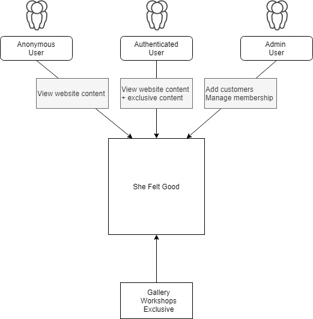
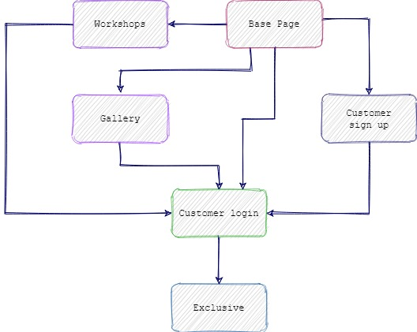
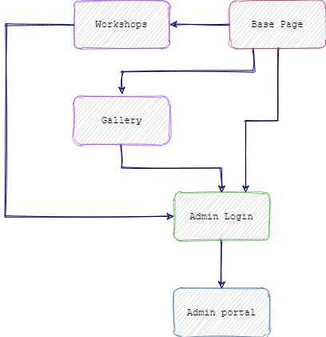
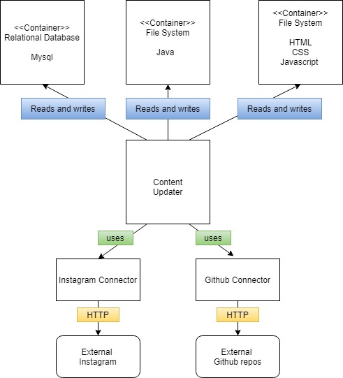

# HobbyProject - She Felt Good

## Table of contents
* [Introduction](#introduction)
* [Clone](#clone)
* [Technologies](#technologies)
* [Design](#design)
* [Management](#managemnt)
* [Launch](#launch)
* [Features](#features)
* [Acknowledgements](#acknowledgements)

## Introduction
The objective of the Hobby Project was to create an OOP-based web application using specific tools, methodologies, and technologies.  It is a full-stack model with CRUD funtionality, with a Javascript API linking webpage user inputs to Java backend application.  The front-end website design was based around my personal hobby of needle felting.

## Clone

https://github.com/shivalasvegas/HobbyProject.git

## Technologies

* Front-end: HTML, CSS, Javascript with Bootstrap templates; tested with selenium.  The website is hosted on a GCP VM instance and hosted by Apache.
* Back-end: Java Spring, MySql; tested with Mockito and built with Maven.  The database is hosted on a GCP Sql instance.  

## Design
The website was designed around three different use cases:  anonymous users, authenticated users and admins.

A more in depth view of pathways through the website.

Pathway for authenticated users:

Pathway for admins:

The back-end application was designed for these use cases, mirrors the KISS design for the website.

## Management

A large part of the project revolved around management as this was a full stack project.  I used an Atlassian New Gen Kanban board with two main user stories for customers and admins .  Each Epic had mulitple child issues with story board points.

#### Admin User Story with acceptance criteria:
*As an admin I want to access  customer profiles on my website so that I can update and view their information.*

*Acceptance Criteria: The admin should be able to access the admin login page, enter their details and gain access to the admin portal page.  They should also be able to access the admin profile page where they can update their details.*

## Launch
 
### Model

The database is hosted on a GCP Sql instance, and is accessed with a username and password.  It can also be built and populated with data using MySql on a personal machine.

### View 

The website can be hosted locally and is also on a GCP vm instance and hosted by Apache. Browsers need to have Javascript enabled for the full fucntionality of the site.   

### Controller

The Java Spring application can be launched by forking the git repository and running the fat jar on a local machine.  

## Features
The website has three main pages, which anonymous users can access: The home page, gallery and workshop pages. A customer can signup to the **Exclusive** webpage via the index page carousel.  Each of the main pages has a login button for users and a login link for admins (Username: admin@admin.com; Password: adm1n2020!@1).  The Admin Portal page displays the full CRUD fucntionality of the Java Application and the Javascrpt API.  Admins have the ability to read, update, delete and create customers and also update their own details.

## Acknowledgments

To my trainers - **Vinesh**, **Alan**, **Shafeeq**, **Savannah**, and **Nick** for being amazing.  And to **Jordan** who sometimes showed up and always threw a spanner in the works ;)
